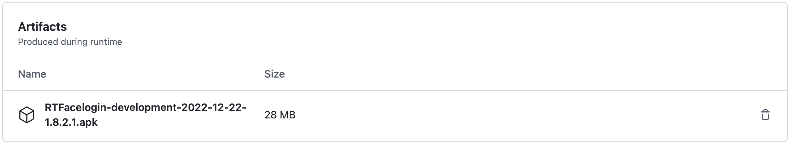

[](https://opensource.org/licenses/Apache-2.0)

# **RoboTutor FaceLogin**

RTFace_Login lets children enroll and log in without knowing how to read or write or relying on someone who can.
See our [State Diagrams](https://docs.google.com/spreadsheets/d/1BvqnAjTn3NTLsrF3rErdrD0e5g484giv8va2116dTHo/edit#gid=2081722669) and [Wireframes](https://drive.google.com/drive/u/1/folders/1L47v6Mqmk5RdskaVfWyO3MqMnWoxoCLv) for a (possibly outdated) wireframe of each state.

## Quick Installation
To quickly install the most recent version of FaceLogin without having to download the full source code, follow these steps:

1. Go to the [Actions tab](https://github.com/RoboTutorLLC/RTFace_Login/actions) of this repository
2. Select the latest working (green check mark) workflow run under the development branch.<br>

3. Locate the apk to the bottom of the page.<br>
4. Download the apk and place them in the *Download* directory of your tablet.
5. Install the FaceLogin APK on your tablet, and launch.

## **Setup and Configuration:**

[Install Android Studio](https://developer.android.com/sdk/index.html)

[Install GitHub Desktop](https://desktop.github.com)

## **Building FaceLogin:**

1. Clone FaceLogin to your computer using Git/GitHub

2. **Import** the FaceLogin project into Android Studio.

3. You may need to install different versions of the build tools and android SDKs.

4. There are a number of build variants you can select to generate versions that support static language selections and also versions that permit dynamic language selection at runtime. In order to generate any flavor that depends on the key signature, you must generate your own keystore (see next steps). Note that the version used is the sw (Swahili) version.

5a. If you do not already have one, follow the steps [here](https://stackoverflow.com/questions/3997748/how-can-i-create-a-keystore) to generate a keystore.

If you do not already have one, follow the steps for Android Studio (https://stackoverflow.com/a/30254012) (for
(https://stackoverflow.com/questions/3997748/how-can-i-create-a-keystore) to generate a keystore. <br>
Sample command:

```
keytool -genkeypair -dname "cn=Mark Jones, ou=JavaSoft, o=Sun, c=US" -alias business -keypass kpi135 -keystore /working/android.keystore -storepass ab987c -validity 20000
```

- *dname* is a unique identifier for the application in the .keystore

    - *cn* the full name of the person or organization that generates the .keystore
    - *ou* Organizational Unit that creates the project, its a subdivision of the Organization that creates it. Ex. android.google.com
    - *o* Organization owner of the whole project. Its a higher scope than ou. Ex.: google.com
    - *c* The country short code. Ex: For United States is "US"

- *alias* Identifier of the app as an single entity inside the .keystore (it can have many)
- *keypass* Password for protecting that specific alias.
- *keystore* Path where the .keystore file shall be created (the standard extension is actually .ks)
- storepass Password for protecting the whole .keystore content.
- *validity* Amount of days the app will be valid with this .keystore

6a. Add a file named "keystore.properties" to your root project directory, and give it the following contents. The values should be based on the values you used to generate the keystore.
```
storePassword=<your_store_password>
keyPassword=<your_key_password>
keyAlias=<your_key_alias>
storeFile=<path_to_location_of_keystore>
```

7a. Use Android Studio or gradlew to generate a signed APK with the flavor *sw*. This will generate the Swahili version of the apk for deployment in Tanzania.

5b. Alternatively, automatic apk generation using Github Actions is also present and triggered for each commit. See Setup and Configuration for insturctions on how to access the automatically generated apk. Take note, that only a Swahili version is produced automatically.

---
